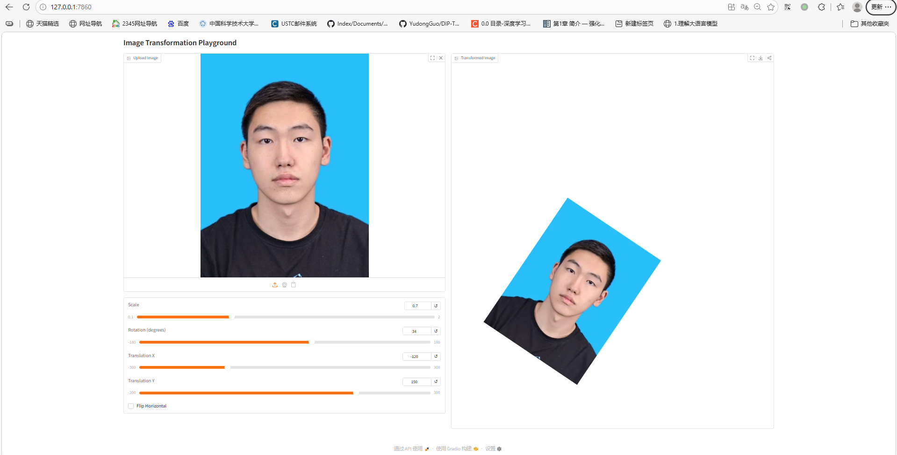
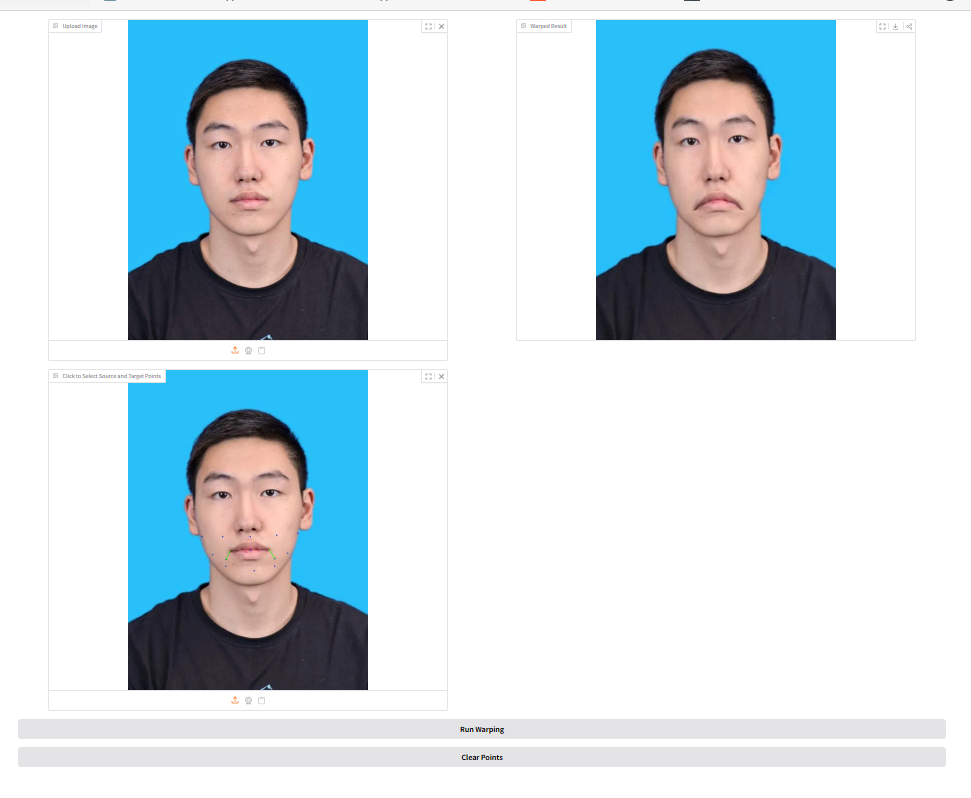

# 作业 1：图像变形

本项目是数字图像处理课程 `Assignment_01` 的实现，主要包含两个部分：

1. 基础图像几何变换。
2. 基于控制点的移动最小二乘图像形变。



## 项目简介

本次作业需要完成两类图像变换任务：

- 全局几何变换：包括缩放、旋转、平移和水平翻转。
- 点引导形变：根据用户选取的源点和目标点，使用移动最小二乘法进行局部非刚性变形。

项目提供了基于 Gradio 的交互界面，可以直接上传图片并在网页中观察变换结果。

## 环境依赖

安装依赖：

```bash
python -m pip install -r requirements.txt
```

主要依赖如下：

- `numpy`
- `opencv-python`
- `gradio`

## 运行方法

### 1. 基础几何变换

运行以下命令启动交互界面：

```bash
python run_global_transform.py
```

该部分支持：

- 按图像中心进行缩放。
- 按图像中心进行旋转。
- 水平方向翻转。
- 在组合变换基础上继续进行平移。

实现说明：

- 为了减少边界裁切，程序会先对白底画布进行扩边。
- 变换通过组合仿射矩阵实现。
- 最终使用 `cv2.warpAffine` 完成图像重采样。

### 2. 基于控制点的图像形变

运行以下命令启动交互界面：

```bash
python run_point_transform.py
```

使用方式：

- 上传一张图片。
- 按“源点、目标点、源点、目标点”的顺序交替点击。
- 点击 `Run Warping` 生成形变结果。
- 点击 `Clear Points` 清空当前控制点。

实现说明：

- 本实现采用移动最小二乘法（Moving Least Squares, MLS）的仿射形变形式。
- 对每个输出像素，根据控制点局部估计一个仿射变换。
- 通过反向映射生成每个输出像素对应的源图像采样位置。
- 最终使用 `cv2.remap` 完成无空洞的图像重映射。

## 结果展示

### 基础几何变换（p1）


### 控制点引导形变（p2）



### 演示视频（video1）

[](pics/video1.mp4)

点击上方预览图可打开 `video1.mp4`。GitHub 仓库首页通常不能稳定直接播放 README 中嵌入的视频，因此这里使用“预览图 + 视频链接”的方式，兼容性更好。

## 参考资料

- [课程课件](https://pan.ustc.edu.cn/share/index/66294554e01948acaf78)
- [Image Deformation Using Moving Least Squares](https://people.engr.tamu.edu/schaefer/research/mls.pdf)
- [Image Warping by Radial Basis Functions](https://www.sci.utah.edu/~gerig/CS6640-F2010/Project3/Arad-1995.pdf)
- [OpenCV Geometric Transformations](https://docs.opencv.org/4.x/da/d6e/tutorial_py_geometric_transformations.html)
- [Gradio 官方文档](https://www.gradio.app/)

## 文件说明

- `run_global_transform.py`：基础图像几何变换交互程序。
- `run_point_transform.py`：基于 MLS 的控制点引导图像形变交互程序。
- `requirements.txt`：项目依赖列表。
- `pics/`：README 中使用的结果图与演示视频，包括 `p1.png`、`p2.png`、`video1.mp4`。

## 说明

- 本 README 采用课程仓库中给出的作业提交模板结构进行整理。
- 当前实现重点是完成作业要求，并提供可交互演示。

## 致谢

控制点图像形变部分参考了经典的移动最小二乘法图像变形方法。
