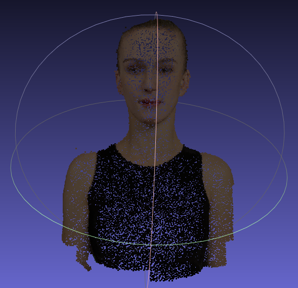
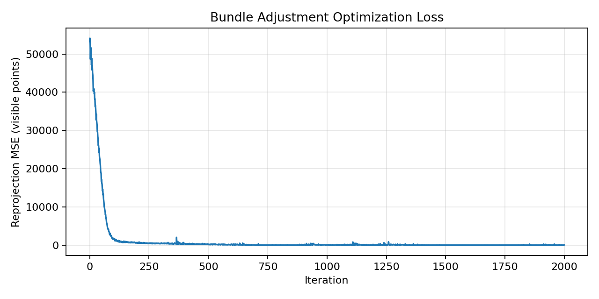
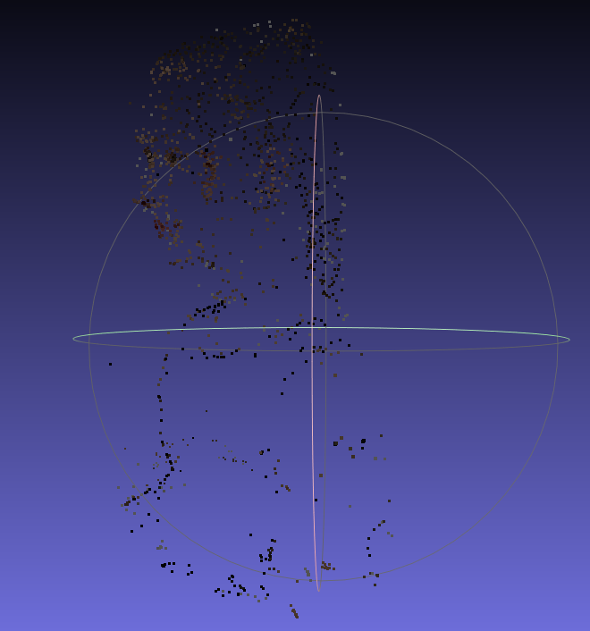
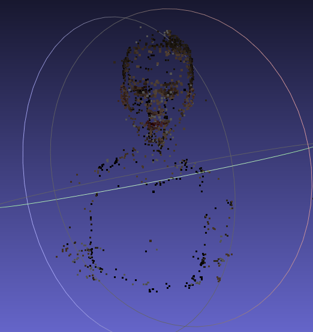

# Assignment 3 Report - Bundle Adjustment

本报告对应数字图像处理课程作业 3，包含两个部分：

1. PyTorch 从零实现 Bundle Adjustment
2. 使用 COLMAP 完成多视图三维重建

## Overview

本次作业目标如下：

1. 仅基于 50 视角下的 2D 观测点，优化恢复共享焦距 `f`、每个相机的外参 `(R, T)`、以及 20000 个 3D 点坐标。
2. 使用 COLMAP 对 `data/images/` 的 50 张图像执行稀疏/稠密重建流程，得到三维点云结果。

代码与脚本：

- `bundle_adjustment_pytorch.py`：Task 1 主脚本（PyTorch BA）
- `run_colmap.sh`：Task 2 命令行流程脚本
- `visualize_data.py`：数据可视化辅助脚本

## Environment

本作业在 Windows + PowerShell 环境下完成，主要依赖如下：

- Python 3.10
- PyTorch (`2.10.0+cpu`)
- NumPy
- Matplotlib
- OpenCV（用于可视化脚本）
- COLMAP（Task 2）

实验使用解释器：

```powershell
C:\Users\Admin\Desktop\vmesh\.venv\Scripts\python.exe
```

项目目录：

```powershell
C:\Users\Admin\Desktop\DIP\DIP-Homework\Assignments\03_BundleAdjustment
```

## Task 1 - Bundle Adjustment with PyTorch

### Task Description

Task 1 要求使用 PyTorch 实现 Bundle Adjustment，优化以下未知量：

1. 相机内参：共享焦距 `f`
2. 外参：50 个视角的旋转 `R` 与平移 `T`
3. 结构：20000 个 3D 点坐标 `(X, Y, Z)`

目标函数为可见点上的重投影误差最小化。

### Method

1. 读取 `points2d.npz`，组织成 `(V, N, 3)`，其中 `V=50, N=20000`。
2. 使用 Euler 角参数化旋转，按 `XYZ` 顺序生成旋转矩阵。
3. 使用作业给定投影公式：
   - `u = -f * Xc/Zc + cx`
   - `v =  f * Yc/Zc + cy`
4. 以可见性 `visibility` 作为 mask，仅在可见点上计算 MSE。
5. 使用 Adam 优化 `f/R/T/3D points`，并添加轻量正则提升稳定性。
6. 导出：
   - `results/loss_curve.png`
   - `results/reconstruction.obj`（彩色点云）
   - `results/ba_params.npz`

### Key Implementation

实现文件：`bundle_adjustment_pytorch.py`

关键点：

1. 旋转参数化：Euler 角 -> 旋转矩阵
2. 正焦距约束：`f = exp(log_f)`，避免非正焦距
3. 小批量优化：每轮随机采样部分 view 和 points，加速训练
4. OBJ 导出格式：每行 `v x y z r g b`，颜色来自 `points3d_colors.npy`

### How to Run

```powershell
cd C:\Users\Admin\Desktop\DIP\DIP-Homework\Assignments\03_BundleAdjustment
C:\Users\Admin\Desktop\vmesh\.venv\Scripts\python.exe .\bundle_adjustment_pytorch.py --iters 2000 --view_batch 10 --point_batch 6000 --log_every 100
```

快速验证（短跑）：

```powershell
C:\Users\Admin\Desktop\vmesh\.venv\Scripts\python.exe .\bundle_adjustment_pytorch.py --iters 120 --view_batch 8 --point_batch 4000 --log_every 20
```

### Verification

按照作业要求，Task 1 进行了以下验证：

1. 收敛验证：loss 曲线整体下降（见 `results/loss_curve.png`）
2. 数值验证：全量可见点重投影误差
3. 结果文件验证：导出彩色 OBJ，检查格式与可视化

本次运行结果（`--iters 2000`）：

- 训练过程中最优 batch 重投影 MSE：`7.306981`
- 全量可见点数：`805089`
- 全量可见点重投影 MSE：`10.235239`
- 全量可见点重投影 RMSE：`3.199256` 像素
- 优化后焦距 `f`：`1320.8596`

输出文件：

- `results/loss_curve.png`
- `results/reconstruction.obj`
- `results/ba_params.npz`

### Results

Loss 曲线：



重建结果展示（本次实验输出截图）：


### Analysis

1. 在仅给定 2D 观测和可见性 mask 的前提下，优化可稳定收敛到较低重投影误差。
2. 焦距与结构/位姿存在尺度耦合，轻量正则可提升训练稳定性。
3. 小批量视角/点采样可显著降低单次迭代开销，适合该规模数据。

## Task 2 - 3D Reconstruction with COLMAP

### Task Description

Task 2 目标是使用 COLMAP 对 `data/images/` 完成三维重建流程。  
按本次机器配置与作业执行要求，本报告完成了**稀疏重建**部分（Feature Extraction / Matching / Mapper）：

1. Feature Extraction
2. Feature Matching
3. Sparse Reconstruction (Mapper / BA)
4. 结果可视化（稀疏点云）

### How to Run

Windows + no-cuda 版本 COLMAP 下，建议使用以下命令（与本次实际运行一致）：

```powershell
$DATASET_PATH="data"
$IMAGE_PATH="$DATASET_PATH/images"
$COLMAP_PATH="$DATASET_PATH/colmap_sparse_nocuda"
$COLMAP_EXE="C:\Users\Admin\Desktop\DIP\tools\colmap-x64-windows-nocuda\COLMAP.bat"

mkdir "$COLMAP_PATH\sparse" -Force | Out-Null

& $COLMAP_EXE feature_extractor `
  --database_path "$COLMAP_PATH/database.db" `
  --image_path "$IMAGE_PATH" `
  --ImageReader.camera_model PINHOLE `
  --ImageReader.single_camera 1 `
  --FeatureExtraction.use_gpu 0 `
  --FeatureExtraction.num_threads 4

& $COLMAP_EXE exhaustive_matcher `
  --database_path "$COLMAP_PATH/database.db" `
  --FeatureMatching.use_gpu 0 `
  --FeatureMatching.num_threads 4

& $COLMAP_EXE mapper `
  --database_path "$COLMAP_PATH/database.db" `
  --image_path "$IMAGE_PATH" `
  --output_path "$COLMAP_PATH/sparse"

& $COLMAP_EXE model_converter `
  --input_path "$COLMAP_PATH/sparse/0" `
  --output_path "$COLMAP_PATH/sparse/0/sparse.ply" `
  --output_type PLY
```

### Results

本次实际运行结果（`data/colmap_sparse_nocuda/sparse/0`）：

- Registered images: `50 / 50`
- 3D points: `1633`
- Observations: `13392`
- Mean track length: `8.200857`
- Mean reprojection error: `0.603115 px`

输出文件：

- `data/colmap_sparse_nocuda/database.db`
- `data/colmap_sparse_nocuda/sparse/0/cameras.bin`
- `data/colmap_sparse_nocuda/sparse/0/images.bin`
- `data/colmap_sparse_nocuda/sparse/0/points3D.bin`
- `data/colmap_sparse_nocuda/sparse/0/sparse.ply`

稀疏点云可视化截图（PLY 打开结果）：

<p align="center">
  
  
</p>

### Analysis

1. COLMAP 的 mapper 阶段本质包含 BA，可作为 Task 1 的工程级对照。
2. `no-cuda` 版本在 Windows 下可稳定完成稀疏重建，但速度和功能不如 CUDA 稠密流程。
3. 该数据集 50 视角全部成功注册，重投影误差较低，说明相机位姿与稀疏结构质量较好。

## Conclusion

本次作业完成了两部分核心内容：

1. Task 1：基于 PyTorch 从零实现 Bundle Adjustment，完成 `f/R/T/3D points` 联合优化，并导出 loss 曲线与彩色点云。
2. Task 2：在 Windows `colmap-x64-windows-nocuda` 环境下完成 COLMAP 稀疏重建，得到 `data/colmap_sparse_nocuda/sparse/0` 稀疏模型与 `sparse.ply` 可视化文件。

## References

- Bundle Adjustment (Wikipedia)  
  https://en.wikipedia.org/wiki/Bundle_adjustment
- PyTorch Optimizer Documentation  
  https://pytorch.org/docs/stable/optim.html
- COLMAP Documentation  
  https://colmap.github.io/
- COLMAP CLI Tutorial  
  https://colmap.github.io/cli.html
