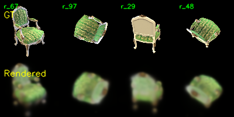
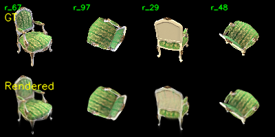
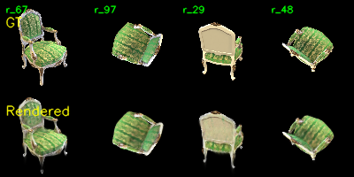
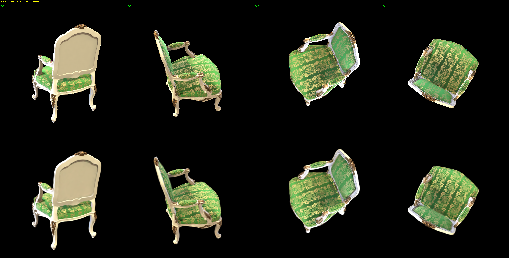
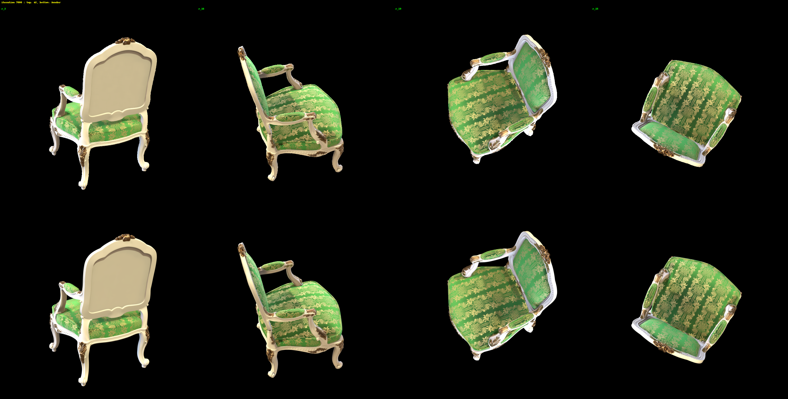
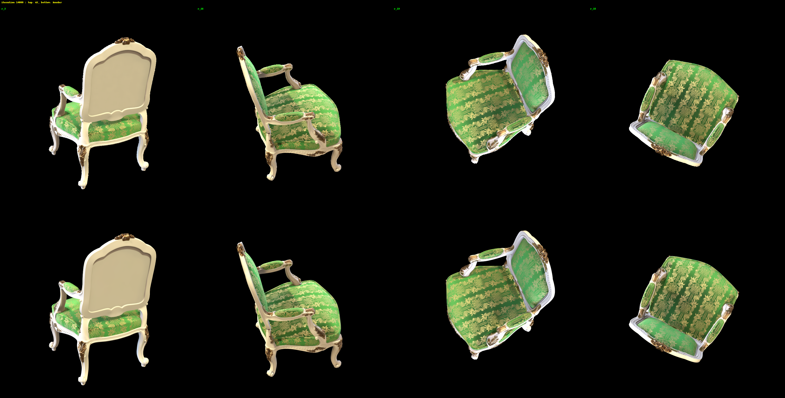

# Assignment 4 Report - Simplified 3D Gaussian Splatting

本报告对应数字图像处理课程作业 4，目标是在 PyTorch 中实现一个简化版 3D Gaussian Splatting pipeline，并基于多视角图像完成场景重建与新视角渲染。

本次实验选择 `chair` 场景完成，主要包含三个部分：

1. 使用 COLMAP 恢复相机参数与稀疏 3D 点云
2. 实现简化 3D Gaussian Splatting 的核心渲染模块
3. 对比分析简化实现与官方 3DGS 实现的差异

## Overview

本次作业的整体流程如下：

1. 输入 `data/chair/images/` 下的 100 张多视角图像。
2. 使用 COLMAP 执行 feature extraction、feature matching、sparse reconstruction，并导出文本格式相机与点云文件。
3. 将 COLMAP 稀疏点初始化为 3D Gaussians，包括位置、颜色、不透明度、旋转与尺度。
4. 实现 3D Gaussian covariance、透视投影、2D Gaussian 取值与 alpha blending。
5. 训练 Gaussian 参数，使渲染结果拟合训练图像。
6. 使用训练后的 checkpoint 渲染水平环绕视频。

核心代码文件：

- `mvs_with_colmap.py`：运行 COLMAP 稀疏重建流程
- `debug_mvs_by_projecting_pts.py`：将 COLMAP 3D 点重投影到图像上进行验证
- `gaussian_model.py`：3D Gaussian 参数初始化与 3D covariance 构造
- `gaussian_renderer.py`：3DGS 投影、Gaussian rasterization 与 alpha blending
- `train.py`：训练主脚本
- `render_3dgs_mv.py`：训练后环绕视频渲染脚本

## Environment

本次实验在 Windows + PowerShell 环境下完成，主要依赖如下：

- Python 3.10
- PyTorch `2.7.0+cu128`
- PyTorch3D `0.7.9`
- NumPy
- OpenCV
- tqdm
- natsort
- COLMAP Windows CUDA 版

Python 解释器：

```powershell
C:\Users\Admin\Desktop\vmesh\.venv\Scripts\python.exe
```

项目目录：

```powershell
C:\Users\Admin\Desktop\DIP\DIP-Homework\Assignments\04_3DGS
```

COLMAP 工具位置：

```powershell
C:\Users\Admin\Desktop\DIP\tools\colmap-x64-windows-cuda
```

## Data

本次实验使用 `chair` 场景：

```text
data/chair/images/
```

原始图像分辨率为 `800 x 800`。代码中的 `ColmapDataset` 默认使用：

```python
downsample_factor = 8
```

因此训练与渲染时的实际分辨率为：

```text
100 x 100
```

这也是 debug 图和最终视频分辨率较低的原因；该下采样设置来自作业源码默认参数。

## Task 1 - Structure-from-Motion with COLMAP

### Task Description

Task 1 要求使用 COLMAP 从多视角图像中恢复相机内外参与稀疏 3D 点云。恢复出的 3D 点作为后续 3D Gaussian 的初始化位置，点颜色作为 Gaussian 初始颜色。

### How to Run

本次运行时使用本地 CUDA 版 COLMAP，并将其 `bin` 目录临时加入 `PATH`：

```powershell
cd C:\Users\Admin\Desktop\DIP\DIP-Homework\Assignments\04_3DGS

$env:PATH='C:\Users\Admin\Desktop\DIP\tools\colmap-x64-windows-cuda\bin;' + $env:PATH
C:\Users\Admin\Desktop\vmesh\.venv\Scripts\python.exe mvs_with_colmap.py --data_dir data/chair
```

重投影验证：

```powershell
C:\Users\Admin\Desktop\vmesh\.venv\Scripts\python.exe debug_mvs_by_projecting_pts.py --data_dir data/chair
```

### Results

COLMAP 输出目录：

```text
data/chair/sparse/0_text/
```

主要结果：

- Registered images: `100 / 100`
- Sparse 3D points: `14361`
- Camera model: `PINHOLE`

输出文件：

- `data/chair/database.db`
- `data/chair/sparse/0/cameras.bin`
- `data/chair/sparse/0/images.bin`
- `data/chair/sparse/0/points3D.bin`
- `data/chair/sparse/0_text/cameras.txt`
- `data/chair/sparse/0_text/images.txt`
- `data/chair/sparse/0_text/points3D.txt`
- `data/chair/projections/`

重投影验证结果保存在：

```text
data/chair/projections/
```

### Analysis

COLMAP 成功注册全部 100 张图像，并恢复出 14361 个稀疏点。该点云对直接渲染来说仍然过于稀疏，因此后续将每个点扩展为一个可优化的 3D Gaussian，通过尺度和不透明度学习覆盖连续空间。

## Task 2 - Simplified 3D Gaussian Splatting

### Task Description

Task 2 是本作业的主要部分，要求补全简化 3DGS 的核心公式：

1. 由四元数旋转和尺度构造 3D covariance
2. 将 3D Gaussian 投影为 2D Gaussian
3. 计算 2D Gaussian 在像素网格上的取值
4. 使用 alpha blending 完成图像渲染

### Method

#### 3D Gaussian Covariance

在 `gaussian_model.py` 中，使用旋转矩阵 `R` 与尺度矩阵 `S` 构造 covariance：

```python
L = R @ S
Cov = L @ L.T
```

这对应 3DGS 中由旋转与缩放分解构造协方差矩阵的方式。

#### Projection to 2D

在 `gaussian_renderer.py` 中，首先将 Gaussian 中心从世界坐标变换到相机坐标：

```python
X_cam = R @ X_world + t
```

再根据 pinhole camera model 投影到像素坐标：

```python
u = fx * x / z + cx
v = fy * y / z + cy
```

2D covariance 使用投影 Jacobian 与世界到相机旋转变换：

```text
Sigma_2D = J W Sigma_3D W^T J^T
```

#### 2D Gaussian Values

对每个像素 `x`，根据 2D Gaussian 公式计算权重：

```text
G(x) = 1 / (2 pi sqrt(det(Sigma))) * exp(-1/2 (x - mu)^T Sigma^-1 (x - mu))
```

实现中使用显式 2x2 矩阵逆，避免大批量 `torch.linalg.inv` 带来的额外开销。

#### Alpha Blending

对按深度排序后的 Gaussians，使用前向透射率累积：

```text
alpha_i = opacity_i * G_i
T_i = product_{j<i}(1 - alpha_j)
C = sum_i T_i * alpha_i * color_i
```

为避免显存过高，渲染实现中加入了视锥筛选与 chunked alpha compositing。训练时使用 checkpointed chunk，降低 backward 阶段的显存占用。

### Key Implementation

主要修改文件：

- `gaussian_model.py`
- `gaussian_renderer.py`

关键实现点：

1. 3D covariance 构造：`Cov = (R S)(R S)^T`
2. 透视投影 Jacobian：显式计算 `du/dx, du/dz, dv/dy, dv/dz`
3. 2D covariance：`J R Sigma R^T J^T`
4. 2D Gaussian：显式计算 determinant 与 2x2 inverse
5. Alpha blending：按深度排序后累积 transmittance
6. 内存控制：屏幕范围筛选 + chunked rendering，避免一次性生成完整 `(N, H, W)` 张量

### How to Train

本次训练使用以下命令：

```powershell
cd C:\Users\Admin\Desktop\DIP\DIP-Homework\Assignments\04_3DGS

C:\Users\Admin\Desktop\vmesh\.venv\Scripts\python.exe train.py `
  --colmap_dir data/chair `
  --checkpoint_dir data/chair/checkpoints `
  --device cuda `
  --num_epochs 60
```

训练设置：

- Scene: `chair`
- Images: `100`
- Batch size: `1`
- Epochs: `60`
- Iterations per epoch: `100`
- Effective training resolution: `100 x 100`
- Debug image save interval: every epoch
- Checkpoint save interval: every 20 epochs

### Training Results

训练输出目录：

```text
data/chair/checkpoints/
```

已保存 checkpoint：

- `checkpoint_000000.pt`
- `checkpoint_000020.pt`
- `checkpoint_000040.pt`

由于源码默认 `save_every=20`，并且训练循环 epoch 编号为 `0` 到 `59`，因此 60 epoch 训练完成后最后一个自动保存的 checkpoint 是：

```text
checkpoint_000040.pt
```

Debug 图像：

```text
data/chair/checkpoints/debug_images/
```

覆盖：

```text
epoch_0000.png ... epoch_0059.png
```

训练过程中的 GT / Rendered 对比图如下。每张图上半部分为 GT，下半部分为当前模型渲染结果。

初始阶段：



训练 20 epoch 后：



训练 40 epoch 后：



训练 60 epoch 结束时：


### Video Rendering

正式环绕视频使用 `render_3dgs_mv.py` 生成：

```powershell
C:\Users\Admin\Desktop\vmesh\.venv\Scripts\python.exe render_3dgs_mv.py `
  --colmap_dir data/chair `
  --checkpoint data/chair/checkpoints/checkpoint_000040.pt `
  --output data/chair/render_mv.mp4 `
  --num_frames 240 `
  --fps 30 `
  --device cuda
```

输出视频：

```text
data/chair/render_mv.mp4
```

正式 30 fps 环绕渲染视频：

<video src="./data/chair/render_mv.mp4" controls width="480"></video>

如果当前 Markdown 预览器不支持内嵌视频，可直接打开：

[render_mv.mp4](./data/chair/render_mv.mp4)

说明：`train.py` 训练结束后也会生成 `data/chair/checkpoints/debug_rendering.mp4`，但该视频源码固定为 `3 fps`，主要用于训练路径 debug；正式展示应使用 `render_3dgs_mv.py` 输出的 `render_mv.mp4`。

### Analysis

1. 本实现为纯 PyTorch rasterization，没有官方 3DGS 的 CUDA tile rasterizer，因此训练速度明显慢于官方实现。
2. 默认下采样到 `100 x 100` 能显著降低训练成本，但输出图像和视频会较模糊。
3. COLMAP 点云为稀疏初始化，未实现 adaptive densification，因此 Gaussian 数量固定，重建细节有限。
4. 简化实现中没有 spherical harmonics，仅使用 RGB 颜色参数，视角相关反射与高频纹理表达能力有限。
5. 分块渲染降低了显存峰值，但训练 backward 需要保留或重算 chunk 的中间量，因此速度与显存之间存在 trade-off。

## Task 3 - 与官方 3DGS 实现对比

### 官方 3DGS 实验设置

为了与本作业的简化 PyTorch 实现进行对比，我们在服务器上的官方 3DGS 环境中运行同一个 `chair` 场景。官方训练使用原始 `800 x 800` 图像，不进行本作业代码中的 8 倍下采样。

官方训练命令如下：

```bash
python train_3dgs.py -s /path/to/chair -m /path/to/output/chair_official -r 1 --iterations 30000 --debug_save_interval 1000 --debug_views 4
```

其中 `-r 1` 表示使用原始分辨率。训练脚本每 1000 次迭代保存一次 GT / render 对比图，并记录训练速度、显存占用和 Gaussian 数量。

本次已下载的官方训练记录覆盖 `1000` 到 `14000` iteration。虽然未包含完整 30000 iteration 的最终结果，但已经覆盖了 adaptive densification 的主要增长阶段，足以用于说明官方实现的速度、显存和渲染质量趋势。

官方输出文件：

- `metrics.jsonl`
- `debug_images/iter_001000.png`
- `debug_images/iter_002000.png`
- ...
- `debug_images/iter_014000.png`

### 官方 3DGS 实验结果

官方 3DGS 训练过程中的 GT / render 对比如下。每张图上半部分为 GT，下半部分为官方 3DGS 渲染结果。

1000 iterations：



7000 iterations：



10000 iterations：


14000 iterations：



官方 3DGS 指标记录如下：

| 迭代次数 | 总损失 | L1 损失 | 单次迭代时间 (ms) | 累计训练时间 (s) | Gaussian 数量 | 峰值显存 (MB) |
|---:|---:|---:|---:|---:|---:|---:|
| 1000 | 0.013514 | 0.007523 | 9.55 | 24.68 | 31,863 | 947.40 |
| 2000 | 0.014673 | 0.007805 | 17.71 | 46.71 | 90,539 | 1050.01 |
| 3000 | 0.008943 | 0.005557 | 12.47 | 68.67 | 155,758 | 1158.69 |
| 4000 | 0.008310 | 0.005131 | 9.84 | 86.19 | 203,809 | 1238.00 |
| 5000 | 0.006975 | 0.004342 | 6.19 | 103.63 | 264,201 | 1334.42 |
| 6000 | 0.010319 | 0.006868 | 11.20 | 122.62 | 313,358 | 1424.69 |
| 7000 | 0.012797 | 0.007747 | 8.33 | 142.67 | 331,973 | 1451.61 |
| 8000 | 0.005853 | 0.003804 | 16.29 | 168.51 | 371,022 | 1518.92 |
| 9000 | 0.007927 | 0.005053 | 14.11 | 200.16 | 397,947 | 1577.72 |
| 10000 | 0.005050 | 0.003300 | 14.10 | 222.92 | 405,263 | 1586.63 |
| 11000 | 0.008686 | 0.006146 | 14.82 | 247.39 | 428,091 | 1618.94 |
| 12000 | 0.005611 | 0.003790 | 10.85 | 272.63 | 441,106 | 1640.87 |
| 13000 | 0.006118 | 0.004006 | 9.15 | 297.63 | 443,166 | 1640.87 |
| 14000 | 0.009039 | 0.006104 | 17.13 | 323.29 | 454,959 | 1660.30 |

汇总：

- 已记录迭代次数：`14000`
- 训练到 14000 次迭代的累计时间：`323.29 s`
- 记录点上的平均单次迭代时间：`12.27 ms`
- 峰值 GPU 显存：`1660.30 MB`
- 最终记录的 Gaussian 数量：`454,959`
- 记录到的最小总损失：`0.005050`

### 对比表格

| 对比项目 | 本作业简化 PyTorch 实现 | 官方 3DGS 实现 |
|---|---|---|
| 输入分辨率 | 8 倍下采样后为 `100 x 100` | 使用原图 `800 x 800`，无下采样 |
| 光栅化方式 | PyTorch 张量计算，并加入分块渲染 | CUDA tile-based rasterizer |
| Gaussian 数量 | 固定为 COLMAP 稀疏点数量：`14361` | 自适应 densification，14000 iter 时为 `454959` |
| 颜色表示 | 每个 Gaussian 一个 RGB 颜色 | Spherical Harmonics |
| 训练速度 | 本地环境下为秒级单次迭代，分块后显存安全但速度较慢 | 服务器记录点平均约 `12.27 ms/iter` |
| 显存占用 | 通过分块和 checkpointing 控制显存，但训练速度下降 | 14000 iter 时记录峰值显存 `1660.30 MB` |
| 渲染质量 | 结果较模糊，高频细节有限 | 轮廓、纹理和局部细节更清晰 |
| 结果分辨率 | debug 图和视频受源码下采样影响，分辨率较低 | debug 图使用原始分辨率 |

### 渲染质量分析

从 debug 图可以看到，官方 3DGS 在 1000 iteration 时已经能恢复主要形状；随着 densification 进行，Gaussian 数量从 `31,863` 增长到 `454,959`，物体轮廓、局部纹理和透明背景边界逐步变清晰。相比之下，本作业简化实现只使用 COLMAP 稀疏点初始化的固定 Gaussian 数量，没有 densification，也没有 spherical harmonics，因此对细节、高频纹理和视角相关颜色的表达能力明显不足。

需要注意的是，本次速度与显存对比不是完全相同硬件环境下的严格 benchmark：官方 3DGS 在服务器环境中运行，而简化 PyTorch 版本在本地 Windows 环境中运行。因此训练速度和显存占用主要用于说明两种实现的工程量级差异，而不是严格的同机性能对比。渲染质量方面，官方结果使用原始 `800 x 800` 分辨率，本作业简化实现使用 `100 x 100` 下采样图像，这也是简化结果明显更模糊的重要原因之一。

### 差异来源

1. **Rasterizer efficiency**：官方实现使用 CUDA tile rasterizer，只处理局部 tile 内有效 Gaussian；本实现主要依赖 PyTorch 张量计算，即使加入 chunking 仍不如专用 CUDA kernel。
2. **Densification**：官方实现会根据梯度自动复制/细分 Gaussian，逐步增加几何与纹理细节；本实现 Gaussian 数量固定为 COLMAP 稀疏点数量。
3. **Appearance model**：官方实现使用 spherical harmonics 表达视角相关颜色，本实现仅优化固定 RGB。
4. **Resolution**：官方实验使用 `800 x 800` 原始图像，本作业简化实现默认使用 `100 x 100` 下采样图像。
5. **Numerical and memory handling**：简化实现需要显式处理 covariance 稳定性、alpha clamp、视锥筛选和分块渲染，否则容易出现 NaN 或显存过高。

## Conclusion

本次作业完成了简化 3D Gaussian Splatting 的完整流程：

1. 使用 COLMAP 在 `chair` 场景上恢复 100 张图像的相机参数与 14361 个稀疏 3D 点。
2. 实现了 3D covariance 构造、3D 到 2D Gaussian 投影、2D Gaussian 权重计算和 alpha blending。
3. 使用 PyTorch 完成 60 epoch 训练，并保存 debug 图、checkpoint 与训练路径 debug 视频。
4. 使用 `render_3dgs_mv.py` 生成正式 30 fps 环绕视频 `data/chair/render_mv.mp4`。
5. 分析了简化 PyTorch 实现与官方 3DGS 在渲染质量、训练速度和显存效率上的差异。

本实现能够帮助理解 3DGS 的核心数学流程，但在工程效率、细节重建能力和最终渲染质量上仍明显弱于官方实现。

## References

- 3D Gaussian Splatting for Real-Time Radiance Field Rendering  
  https://repo-sam.inria.fr/fungraph/3d-gaussian-splatting/3d_gaussian_splatting_low.pdf
- Official 3DGS Implementation  
  https://github.com/graphdeco-inria/gaussian-splatting
- COLMAP Documentation  
  https://colmap.github.io/
- PyTorch Documentation  
  https://pytorch.org/docs/stable/index.html
